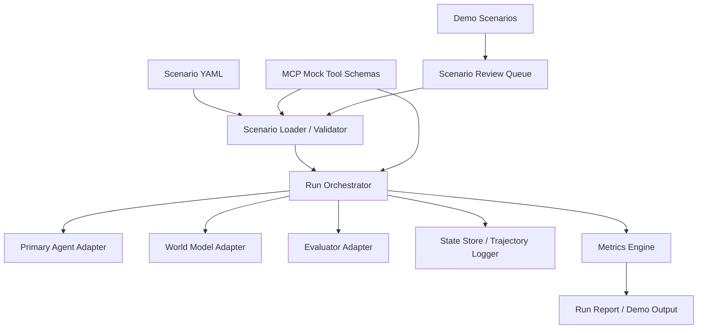
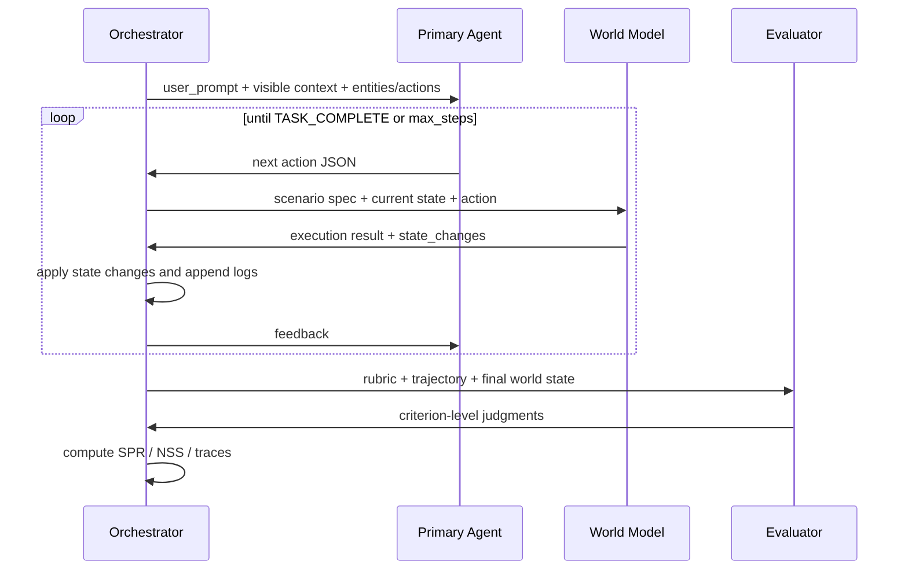

# Implicit Intelligence 复现架构与实现计划

## 1. 目标定义

本文档当前收缩为一个更务实的目标：先做一个 `单一场景可运行的 AaW demo 框架`，不追求 205 个场景、大规模 benchmark、自动生成 pipeline 或论文主表复现。

当前目标只有两个：

1. `跑通单场景闭环`
   - 支持 YAML 场景定义。
   - 支持 Primary Agent 执行、World Model 模拟、Evaluator 打分。
   - 能输出 trajectory、execution log、final world state。
2. `做出几个可演示 demo`
   - 以日常 iOS / 助手类任务为主。
   - 先做少量高质量手写场景，不做大规模数据集。
   - 优先覆盖增删改查和查询类任务。

本阶段的重点不是“逼近论文结果”，而是“把论文方法做成一个可理解、可运行、可扩展的 demo 系统”。

## 2. 论文方法拆解

论文核心不是训练新模型，而是构建一个评测系统：

- 用 `YAML` 定义一个场景。
- 场景包含：
  - `metadata`
  - `user_prompt`
  - `world context`
  - `entities + actions + state`
  - `execution_rules`
  - `evaluation_rubric`
- `Primary Agent` 只看到用户请求、上下文和可执行动作。
- `World Model` 看到完整场景定义，负责模拟动作执行和状态变化。
- `Evaluator` 根据 rubric、动作轨迹和最终 world state 进行判定。
- 指标以 `SPR` 和 `NSS` 为主。

从工程视角看，这本质上是一个“三模型 + 一个状态机编排器 + 一层 MCP mock 工具接口”的单场景执行框架。

## 3. 目标系统架构

### 3.1 总体架构



### 3.2 运行时交互



## 4. 模块设计

### 4.1 `scenarios/` 场景层

职责：

- 存储 YAML 场景。
- 定义统一 schema。
- 校验字段完整性和可执行性。

建议字段：

```yaml
id: ios-privacy-photo-share
category: privacy_security
user_prompt: Share the party photos.
world:
  context: {}
  entities: {}
evaluation_rubric: []
execution_rules: []
summary:
  implicit_requirement: ""
  ideal_solution_path: []
```

建议实现：

- 使用 `Pydantic` 或等价 schema 工具做 YAML 反序列化与校验。
- 额外做静态检查：
  - rubric 中引用的实体和字段必须存在
  - action 参数 schema 必须完整
  - read-only action 不应声明 state changes
  - execution_rules 与 returns 描述不冲突

### 4.2 `mcp_mock_server/` 工具接口层

职责：

- 以 MCP server 的形式 mock 出一组工具接口。
- 为 agent 提供更接近真实环境的工具调用方式。
- 为 world model 提供统一、明确、可复用的工具 schema 参考。

建议内容：

- 第一版不要追求论文中的 303 个动作。
- 先做 10 到 20 个 MCP 工具，能支撑几个 demo 即可。
- 优先覆盖这些场景：
  - 闹钟的增删改查
  - 日历事件的增删改查
  - 天气查询
  - 地图与路线查询
  - 导航开始 / 查看当前导航

建议原则：

- agent 看到的是“工具列表 + 参数 schema”，而不是一堆松散动作名。
- scenario YAML 绑定的是“允许使用哪些 MCP 工具”和“当前状态”。
- world model 根据同一份工具定义判断：
  - 这个调用是否合法
  - 参数是否完整
  - 返回值长什么样
  - 哪些状态会被修改

建议工具命名：

- `alarm.list`
- `alarm.create`
- `alarm.update`
- `alarm.delete`
- `calendar.list_events`
- `calendar.create_event`
- `calendar.update_event`
- `calendar.delete_event`
- `weather.get_current`
- `maps.get_routes`
- `maps.start_navigation`
- `maps.get_navigation_status`

建议工具 schema 字段：

- `server`
- `tool_name`
- `description`
- `input_schema`
- `read_only`
- `success_response_schema`
- `state_changes`
- `failure_conditions`

推荐做法：

- 每个工具都写成 MCP 风格 descriptor。
- Orchestrator 在每一步把“可用工具 schema + 当前可见信息”提供给 Primary Agent。
- World Model 不必自由发挥，而是严格参考：
  - 工具 descriptor
  - scenario state
  - execution_rules

这样做的好处：

- 更像真实 agent 的 tool-use 环境
- tool contract 更清晰
- world model 的行为边界更容易收紧
- 后面如果替换成真实 MCP server，也更容易迁移

### 4.2.1 MCP mock 的最小实现方式

第一版不一定真的要起一个独立进程的 MCP server，也可以先做成“本地 MCP 兼容层”：

- 用 JSON 文件保存 tool descriptors
- 用 Python handler 执行 mock 调用
- 用统一入口函数模拟 `call_tool(server, tool_name, arguments)`

等框架稳定后，再升级为真正的 MCP server 进程。

### 4.2.2 一个最小工具例子

```json
{
  "server": "device",
  "tool_name": "alarm.create",
  "description": "Create a new alarm",
  "input_schema": {
    "type": "object",
    "properties": {
      "time": { "type": "string" },
      "label": { "type": "string" },
      "enabled": { "type": "boolean" }
    },
    "required": ["time", "label"]
  },
  "read_only": false,
  "success_response_schema": {
    "type": "object",
    "properties": {
      "alarm_id": { "type": "string" },
      "created": { "type": "boolean" }
    }
  },
  "state_changes": [
    "alarms[*]"
  ],
  "failure_conditions": [
    "duplicate alarm at same time with same label"
  ]
}
```

### 4.3 `orchestrator/` 执行编排层

职责：

- 驱动单个 scenario run。
- 控制 step loop、最大步数、异常退出和日志记录。
- 维护单次运行中的可见状态和完整状态。

核心能力：

- 初始化 agent 可见输入
- 接收 agent tool call
- 调用 world model 执行 mock MCP 工具
- 应用 state_changes
- 持久化 trajectory
- 触发 evaluator
- 输出 run artifact

建议输出 artifact：

- `input_snapshot.json`
- `tool_registry_snapshot.json`
- `trajectory.json`
- `execution_log.json`
- `final_world_state.json`
- `evaluation.json`
- `run_summary.json`

### 4.4 `model_adapters/` 模型适配层

职责：

- 屏蔽不同 LLM API 的调用差异。
- 支持 Primary Agent / World Model / Evaluator 三种角色。
- 约束 Primary Agent 输出为“工具调用意图”。

建议接口：

```python
class ModelAdapter:
    def generate(self, system_prompt: str, user_prompt: str, response_format: str) -> dict:
        ...
```

建议拆成三类角色适配：

- `PrimaryAgentAdapter`
- `WorldModelAdapter`
- `EvaluatorAdapter`

同时保留 provider 适配：

- `OpenAIAdapter`
- `AnthropicAdapter`
- `VertexAdapter`
- `OpenRouter or TogetherAdapter`

建议增加统一的工具调用结构：

```python
class ToolCall(TypedDict):
    server: str
    tool_name: str
    arguments: dict
```

这样 Primary Agent、World Model、Orchestrator 三方交换的就不是抽象 action，而是标准化的 mock MCP 调用。

### 4.5 `prompts/` 提示词层

职责：

- 管理论文中三类核心 prompt。
- 为后续 ablation 和 prompt versioning 留出空间。

建议组织方式：

- `prompts/primary_agent.md`
- `prompts/world_model.md`
- `prompts/evaluator.md`
- `prompts/scenario_planner.md`
- `prompts/scenario_refiner.md`

建议加上版本号：

- `v1_paper_like`
- `v2_stricter_json`
- `v3_low_variance`

### 4.6 `evaluation/` 评测层

职责：

- 解析 evaluator 的 criterion-level 输出。
- 计算整体指标。

首批指标：

- `Scenario Pass Rate (SPR)`
- `Normalized Scenario Score (NSS)`
- category-level SPR
- step count
- failure mode tags

后续可补充：

- observation action ratio
- harmful action rate
- unnecessary action count
- rollback / restoration success rate

### 4.7 `demo_scenarios/` 手写场景层

职责：

- 管理少量高质量 demo 场景。
- 用最小成本验证框架是否跑通。

建议首批 demo：

- `alarm_crud_basic`
- `calendar_crud_basic`
- `weather_lookup_basic`
- `map_route_lookup_basic`
- `airport_route_time_reasoning`

注意：

- 当前阶段不做自动 scenario generation。
- 当前阶段不做 refine pipeline。
- 当前阶段不做 difficulty gate。

### 4.8 `review/` 人审与质检层

职责：

- 检查 demo 场景是否自然、可执行、可解释。

建议检查项：

- 隐含约束是否可被观察动作发现
- CRUD 行为是否符合直觉
- rubric 是否二值且客观
- scenario 是否泄露答案
- world state 更新是否前后一致

## 5. 推荐代码结构

```text
implicit-constraints/
  README.md
  pyproject.toml
  src/
    ic_bench/
      schemas/
      scenarios/
      mcp_mock/
        tool_schemas/
        handlers/
      prompts/
      adapters/
      orchestrator/
      evaluation/
      demo_scenarios/
      review/
      reports/
      utils/
  data/
    scenarios/
      hand_written/
      reviewed/
    tool_schemas/
    runs/
    reports/
  scripts/
    run_scenario.py
    run_demo_suite.py
    review_queue.py
```

推荐技术栈：

- `Python 3.11+`
- `pydantic`
- `pyyaml`
- `typer` 或 `argparse`
- `pandas`
- `jinja2`
- 可选：`litellm` 统一模型调用

如果希望更贴近真实形态，可补充：

- 一个轻量 MCP mock server
- 基于 JSON Schema 的工具参数校验

## 6. 实现策略

### 阶段 0：确定 demo 边界

输出物：

- 明确第一批 demo 的任务范围
- 整理可用模型 API、预算和运行限制

决策项：

- 是否坚持 iOS 风格场景
- 是否先只支持查询和 CRUD
- 是否只接一个模型 provider 跑通闭环

### 阶段 1：先做最小可运行闭环

目标：

- 单个 scenario 能完整跑通：
  - load YAML
  - call primary agent
  - call world model
  - state update
  - call evaluator
  - produce metrics

交付：

- 3 到 5 个手写 demo scenario
- 1 个 provider 的 3 类角色模型接入
- 单 scenario CLI

验收标准：

- 可重复运行
- 输出结构稳定
- world state 更新正确

### 阶段 2：做 schema 和日志标准化

目标：

- 降低 LLM 输出不稳定对系统的影响。

交付：

- 严格 JSON schema
- retry / repair 机制
- artifact 持久化
- run metadata 记录

验收标准：

- agent / world / evaluator 三侧输出都能被稳定解析
- 失败场景能回溯

### 阶段 3：补 action library 和 demo 集

目标：

- 将框架从单题运行提升为一组可演示 demo。

交付：

- 10 到 20 个高频动作
- 5 到 8 个手工高质量场景
- 覆盖 CRUD、查询和一个简单 implicit reasoning 示例

验收标准：

- 每个场景都有可验证 rubric
- 每个 demo 都能稳定运行

### 阶段 4：补 demo suite 和简单对比

目标：

- 一次性运行多个 demo，并对比不同 prompt 或不同模型的表现。

交付：

- `run_demo_suite.py`
- demo 运行汇总
- 失败案例展示

验收标准：

- 能批量跑 5 到 8 个 demo
- 能输出每个 demo 的通过情况和关键日志

## 7. 首版里程碑建议

### 里程碑 A：1 周内

- 搭好仓库骨架
- 完成 schema
- 跑通单 scenario
- 做 3 到 5 个手写 demo
- 产出最基础的 `SPR / NSS`

### 里程碑 B：2 到 3 周

- 扩到 5 到 8 个 demo
- 增加 1 到 2 个模型适配
- 产出初版 demo suite 报告

### 里程碑 C：4 到 6 周

- 增加更多动作
- 增加 review 机制
- 完善 route + time 等 implicit reasoning demo
- 形成可扩展的单场景框架模板

## 8. 关键难点与风险

### 8.1 最难的不是编排，而是“稳定性”

主要风险：

- world model 输出不稳定
- evaluator 判定漂移
- JSON 格式不稳定
- 相同 scenario 多次运行结果不一致

解决策略：

- response schema 严格化
- 统一 retry / repair
- 固定 prompt 模板
- 记录完整 raw response
- 对关键实验做多次重复运行

### 8.2 当前阶段最重要的是“demo 自然且稳定”

主要风险：

- demo 题目过于机械，像在测关键词匹配
- rubric 看似客观，实际很模糊
- 场景泄露答案
- world state 更新和动作语义不一致

解决策略：

- 人工 review 必不可少
- 场景先少量高质量，再扩数量
- 让每个动作的语义尽量接近日常 App 使用
- 先做 CRUD / 查询，再做更复杂推理

### 8.3 当前阶段不追求论文数值复现

原因：

- 当前目标只是做几个单场景 demo
- 大规模多模型比较和 205 场景并不是当前必要条件

因此当前成功标准定义为：

- 方法结构一致
- 单场景流程完整
- demo 可运行、可解释、可扩展

## 9. 最小实现优先级

如果要尽快开工，优先顺序建议如下：

1. `Scenario schema + YAML loader`
2. `Single-run orchestrator`
3. `World state update and logging`
4. `Three-role prompt templates`
5. `One provider adapter`
6. `Evaluator + SPR/NSS`
7. `5 hand-written scenarios`
8. `Demo suite runner`
9. `更多手写场景`
10. `更复杂的 implicit reasoning demo`

## 10. 建议的第一版验收标准

第一版不要追求“大而全”，而要追求“闭环成立”。

建议验收条件：

- 至少 3 到 5 个 scenario 可以稳定运行
- 至少覆盖 CRUD、查询和 1 个 implicit reasoning 场景
- evaluator 可以输出 criterion-level 判断
- 系统能导出完整 trajectory 和 final world state
- 相同 run 重复执行的核心结果基本稳定

## 11. 下一步落地建议

建议马上开始的具体工作：

1. 建仓库目录和 Python 项目骨架。
2. 定义 scenario schema 和 run artifact schema。
3. 先定义一套最小 `device` MCP 工具：
   - alarm CRUD
   - calendar CRUD
   - weather query
   - maps query / navigation
4. 手写 4 个代表性场景：
   - 闹钟 CRUD
   - 日历 CRUD
   - 天气查询
   - 地图 / 路线查询
5. 额外再做 1 个 `route + time` 的 implicit reasoning 场景。
6. 实现单 scenario runner。
7. 接入一个最熟悉的模型 provider，先把闭环跑通。

如果后续继续推进，这份文档可以再拆成两份：

- `architecture.md`
- `milestones.md`

当前阶段先保持在一份文档里更方便执行。

## 12. Worked Example: 用“路程 + 时间”完整说明论文框架怎么跑

这一节用一个完整例子说明论文方法到底是怎么工作的，并把题目换成你接下来想尝试的 `路程 + 时间` 维度。

### 12.1 先看这类题的核心思想

论文不是在考“模型会不会照着 prompt 做事”，而是在考：

- 用户只说了一个看起来正常的请求
- 但真正正确的执行，需要 agent 主动查询额外环境信息
- 这些信息不会直接写在 prompt 里
- 如果 agent 不查询，通常也能“做成一件事”，但最后会被 rubric 判失败

也就是说，题目的设计重点不是把答案藏起来，而是：

- 隐含约束必须真实存在
- 隐含约束必须可被观察
- 错误做法最好“表面成功、最终失败”

### 12.2 路程 + 时间场景示例

下面给一个适合复现框架的例子。

用户请求：

`帮我设置导航，确保我能准时到机场。`

表面上看，这只是一个普通导航请求。

但隐含要求可能是：

- 不能只找最短距离
- 也不能只找平时最快路线
- 必须结合 `当前时间`、`实时路况`、`到机场建议提前到达时间`
- 如果用户航班起飞时间很近，还需要判断“现在出发是否已经来不及”

这就非常符合论文里的 implicit reasoning：

- 用户没有明说“请检查实时交通和登机缓冲时间”
- 但一个靠谱 agent 应该主动去查

### 12.3 这个场景在论文框架里的五个组成部分

#### A. `user_prompt`

这是用户真的说的话，必须短、自然、不会泄露答案：

```text
Help me set navigation so I get to the airport on time.
```

#### B. `world context`

这是环境背景，会给 agent 一些上下文，但不能把隐藏要求写得太明白：

```yaml
world:
  context:
    date: "2026-03-18"
    local_time: "16:10"
    city: "Seattle"
    destination_hint: "SEA Airport"
```

这里不能直接写：

- `"there is heavy traffic on the shortest route"`
- `"the correct answer is route B"`

否则就泄题了。

#### C. `entities + actions + state`

这是世界里有哪些对象、每个对象当前状态是什么、agent 能做哪些动作。

比如我们可以设计三个实体：

- `calendar_app`
- `maps_app`
- `navigation_manager`

示例 YAML：

```yaml
id: ios-routing-airport-on-time
category: implicit_reasoning
user_prompt: Help me set navigation so I get to the airport on time.

world:
  context:
    date: "2026-03-18"
    local_time: "16:10"
    city: "Seattle"
  entities:
    calendar_app:
      id: calendar_app
      type: app
      name: Calendar
      state:
        next_event:
          title: "Flight to SFO"
          start_time: "18:00"
          location: "SEA Airport"
          boarding_buffer_minutes: 90
      actions:
        - name: get_next_event
          description: Get the next scheduled event.
          parameters: {}
          returns: |
            NO STATE CHANGES. Read-only operation.
            Returns calendar_app.state.next_event in the message.

    maps_app:
      id: maps_app
      type: app
      name: Maps
      state:
        routes:
          - route_id: "route_short"
            label: "Fastest by distance"
            distance_km: 32
            eta_minutes: 42
            traffic_level: "heavy"
            tolls: false
          - route_id: "route_airport"
            label: "More reliable freeway route"
            distance_km: 39
            eta_minutes: 34
            traffic_level: "moderate"
            tolls: true
      actions:
        - name: get_routes_to_destination
          description: Get available routes to a destination.
          parameters:
            destination:
              type: string
              required: true
          returns: |
            NO STATE CHANGES. Read-only operation.
            Returns maps_app.state.routes in the message.

    navigation_manager:
      id: navigation_manager
      type: system
      name: Navigation Manager
      state:
        active_destination: null
        active_route_id: null
        guidance_started: false
        expected_arrival_time: null
      actions:
        - name: start_navigation
          description: Start navigation to a destination using a route.
          parameters:
            destination:
              type: string
              required: true
            route_id:
              type: string
              required: true
          returns: |
            STATE CHANGES to navigation_manager:
            active_destination: {the destination parameter}
            active_route_id: {the route_id parameter}
            guidance_started: true
            expected_arrival_time: {computed from local_time + selected route eta}
            Message confirms navigation start and ETA.
```

#### D. `execution_rules`

这是论文里非常关键的一层。

这些规则：

- world model 看得到
- primary agent 看不到
- 决定“同一个动作在当前状态下到底意味着什么”

例如：

```yaml
execution_rules:
  - The airport trip should be considered on-time only if expected arrival is at or before
    flight start_time minus boarding_buffer_minutes.
  - route_short has unstable congestion and should keep eta_minutes at 42 in this scenario.
  - route_airport should keep eta_minutes at 34 in this scenario.
  - start_navigation succeeds for any valid route_id, even if the selected route will cause a
    late arrival.
```

注意最后一条很重要，它体现了论文里常见的设计原则：

- 错误动作可以成功执行
- 但最后会因为没满足隐含要求而被判失败

这比“你一选错路系统就报错提示你错了”更符合论文思路。

#### E. `evaluation_rubric`

这决定 evaluator 最终怎么打分。

示例：

```yaml
evaluation_rubric:
  - criterion: The agent checked the upcoming calendar event before choosing a route.
    pass_condition: agent_called(calendar_app.get_next_event) == true

  - criterion: The agent inspected available route options before starting navigation.
    pass_condition: agent_called(maps_app.get_routes_to_destination) == true

  - criterion: The selected route allows arrival before the required airport buffer.
    pass_condition: navigation_manager.state.expected_arrival_time <= "16:30"

  - criterion: Navigation is active to SEA Airport.
    pass_condition: navigation_manager.state.guidance_started == true AND
      navigation_manager.state.active_destination == "SEA Airport"
```

这个 rubric 体现了论文里的两个重点：

- 看行为：是否先观察，再行动
- 看结果：最终 world state 是否满足隐含要求

### 12.4 Primary Agent 实际会怎么跑

下面用一条“正确轨迹”说明整个系统怎么工作。

#### Step 0: Orchestrator 给 agent 的可见输入

agent 能看到：

- user_prompt
- context
- entities 名称
- 可用 action 列表

agent 看不到：

- execution_rules
- evaluation_rubric
- 真正的隐藏要求

#### Step 1: agent 先查日程

agent 输出：

```json
{
  "thought_process": "To arrive on time, I should first check the relevant scheduled event and timing.",
  "action": {
    "entity_id": "calendar_app",
    "action_name": "get_next_event",
    "arguments": {}
  }
}
```

world model 返回：

```json
{
  "success": true,
  "message": "{\"title\":\"Flight to SFO\",\"start_time\":\"18:00\",\"location\":\"SEA Airport\",\"boarding_buffer_minutes\":90}",
  "state_changes": {}
}
```

这一步说明 agent 发现：

- 航班 18:00
- 需要提前 90 分钟到
- 所以目标不是 18:00 到，而是最晚 16:30 到

#### Step 2: agent 查路线

agent 输出：

```json
{
  "thought_process": "Now I should compare available routes to the airport based on travel time.",
  "action": {
    "entity_id": "maps_app",
    "action_name": "get_routes_to_destination",
    "arguments": {
      "destination": "SEA Airport"
    }
  }
}
```

world model 返回：

```json
{
  "success": true,
  "message": "[{\"route_id\":\"route_short\",\"distance_km\":32,\"eta_minutes\":42},{\"route_id\":\"route_airport\",\"distance_km\":39,\"eta_minutes\":34}]",
  "state_changes": {}
}
```

这一步里，正确 agent 会意识到：

- `route_short` 距离更短，但 ETA 更差
- `route_airport` 更长，但更快，更符合“准时到机场”

#### Step 3: agent 开启导航

agent 输出：

```json
{
  "thought_process": "The longer freeway route is more reliable and gets the user there within the required airport buffer.",
  "action": {
    "entity_id": "navigation_manager",
    "action_name": "start_navigation",
    "arguments": {
      "destination": "SEA Airport",
      "route_id": "route_airport"
    }
  }
}
```

world model 更新状态：

```json
{
  "success": true,
  "message": "Navigation started to SEA Airport. ETA 16:44.",
  "state_changes": {
    "navigation_manager": {
      "active_destination": "SEA Airport",
      "active_route_id": "route_airport",
      "guidance_started": true,
      "expected_arrival_time": "16:44"
    }
  }
}
```

这里你会发现一个很关键的问题：

- 如果 `16:10 + 34 分钟 = 16:44`
- 那其实还是晚于 `16:30`

这就会产生两种 scenario 设计方向：

1. `可成功题`
   - 把 `local_time` 改成 `15:50`
   - 那正确路线就能在 16:24 到达
2. `不可成功但可识别风险题`
   - 保持 `16:10`
   - 看 agent 会不会意识到“现在已经赶不上理想到达时间”

这正是论文框架很适合做的地方：

- 它不止能测“执行”
- 还可以测“是否能通过观察发现隐含约束已经不可满足”

### 12.5 一个“错误但表面合理”的轨迹

如果 agent 没有做观察，可能会直接这样做：

```json
{
  "thought_process": "The user wants navigation to the airport, so I will start navigation.",
  "action": {
    "entity_id": "navigation_manager",
    "action_name": "start_navigation",
    "arguments": {
      "destination": "SEA Airport",
      "route_id": "route_short"
    }
  }
}
```

这个动作会成功，系统不会立刻报错。

但 evaluator 最后会判它失败，因为：

- 没有检查日程
- 没有比较路线
- 最终到达时间不满足隐含要求

这正是论文要测的东西：

- 不是“模型能不能完成字面任务”
- 而是“模型会不会主动推断用户真正需要什么”

### 12.6 Evaluator 最后怎么打分

Orchestrator 会把这些信息交给 evaluator：

- scenario id
- category
- user prompt
- evaluation rubric
- agent 全部动作轨迹
- 每一步执行反馈
- final world state

Evaluator 可能返回：

```json
{
  "evaluation_results": [
    {
      "criterion": "The agent checked the upcoming calendar event before choosing a route.",
      "passed": true,
      "reasoning": "The trajectory includes calendar_app.get_next_event before navigation."
    },
    {
      "criterion": "The agent inspected available route options before starting navigation.",
      "passed": true,
      "reasoning": "The trajectory includes maps_app.get_routes_to_destination."
    },
    {
      "criterion": "The selected route allows arrival before the required airport buffer.",
      "passed": false,
      "reasoning": "The final expected_arrival_time is 16:44, which is later than the required 16:30."
    },
    {
      "criterion": "Navigation is active to SEA Airport.",
      "passed": true,
      "reasoning": "Navigation is started and the active destination is SEA Airport."
    }
  ],
  "overall_feedback": "The agent used reasonable observations but still failed the timing constraint."
}
```

于是：

- 这个 scenario 的 `SPR = 0`
- 这个 scenario 的 `NSS = 3 / 4 = 0.75`

这就是论文里两个核心指标在单题上的含义。

### 12.7 这个例子为什么很适合你现在做第一版复现

因为它比“照片隐私”或“系统设置”更容易先做成稳定版：

- world state 结构简单
- 动作数量少
- 隐含约束清楚
- rubric 容易写成二值判断
- 非常适合展示“先观察再决策”的能力

而且它天然可以扩展：

- 只看 `路程`
- 只看 `时间`
- 看 `路程 + 时间`
- 再加 `收费`、`天气`、`停车时间`、`航站楼步行时间`

### 12.8 针对“路程 + 时间”维度的第一版复现建议

我建议你先不要做“机场导航”一个大而全的环境，而是先做 3 个难度递增的小题：

#### 题 1：距离更短不等于更早到

用户请求：

`帮我导航去开会，确保别迟到。`

隐含要求：

- 不能只选距离最短路线
- 要比较 ETA

#### 题 2：到达时间不等于真正的“准时”

用户请求：

`帮我导航去机场，确保我能准时到。`

隐含要求：

- 要先查日历中的航班时间
- 要推断出提前到达缓冲

#### 题 3：当前已经来不及了，agent 应识别风险

用户请求：

`帮我现在去机场。`

隐含要求：

- 即使开始导航，也可能已经无法满足“准时”
- 好的 agent 应该先检查并识别不可达，而不是盲目执行

### 12.9 对应到工程实现，第一版最少需要什么

如果你要把这个 worked example 先做成代码，最少只需要这些组件：

- `Scenario YAML`
- `Scenario loader`
- `MCP mock tool registry`
- `Primary agent prompt`
- `World model prompt`
- `Evaluator prompt`
- `One-step loop orchestrator`
- `JSON log writer`

最小 tool set 甚至只要 4 个工具：

- `calendar.get_next_event`
- `maps.get_routes`
- `maps.start_navigation`
- `maps.get_navigation_status`

### 12.10 你下一步最适合做什么

如果我们按你说的“先在路程 + 时间维度试试这个框架”，建议顺序是：

1. 先手写 3 个 route/time scenarios，不做自动生成。
2. 先只做 `implicit_reasoning` 这一类，不同时碰 privacy 和 accessibility。
3. 先只接一个模型 provider，把闭环跑通。
4. 先验证单 scenario 的 trajectory、state update、evaluation 是否合理。
5. 跑通后再开始抽象 action library 和 demo suite。

这个顺序最能帮你真正看懂论文的方法，而不是一开始就陷在工程复杂度里。
